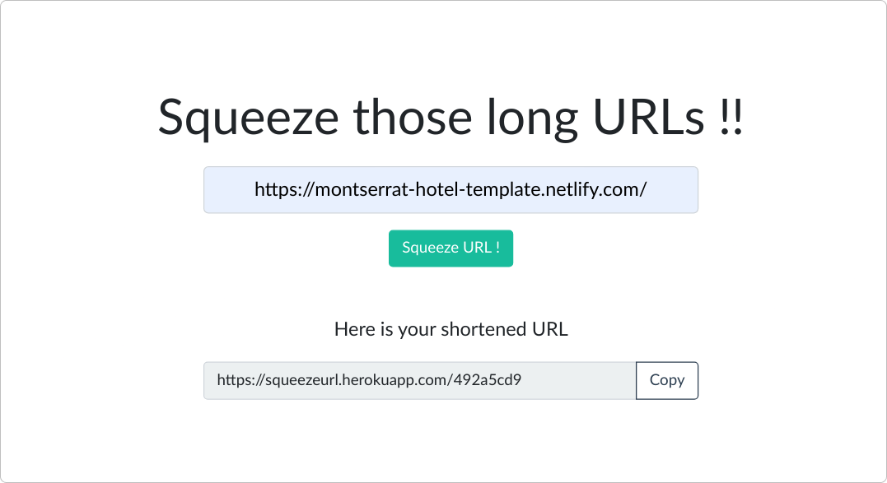

# URL Shortener 

This project is a url shortener service like other services present on internet. It makes sharing of  long urls easy in places where user faces word limits when sharing such urls. 

[Live Demo](https://squeezeurl.herokuapp.com/)




Incentive of creating this project was to practice **system design** and implement it in a project. 


#### Demo

You can see the working demo [here](https://squeezeurl.herokuapp.com/).


### Requirements

- Node.js & NPM
- Mongodb (If you want to use locally installed version)


#### Environment Variables

There are some environment variables that you can define inside `.env` file in the project. They are mainly required if you want to use the cloud hosted mongodb instead of local one.

```
MONGO_USERNAME=yourmongousername
MONGO_PASSWORD=yourmongopassword
```


You can configure the database connection in `db.config.js` file in `config` folder.


### Commands

You can clone this repo and run the following commands to start project

```bash
# install dependencies
npm install

# run development server
npm run dev
```


### Technologies used

- Nodejs 12.x
- Express 4.17.1
- EJS Template engine
- Mongodb 4.2.9
- Mongoose ODM 5.10.0 
- Bootstrap 4
- Axios (for AJAX requests)


### Inspiration

This app is inspired from Hussein Nasser's Youtube tutorial - URL Shortener System Design. 